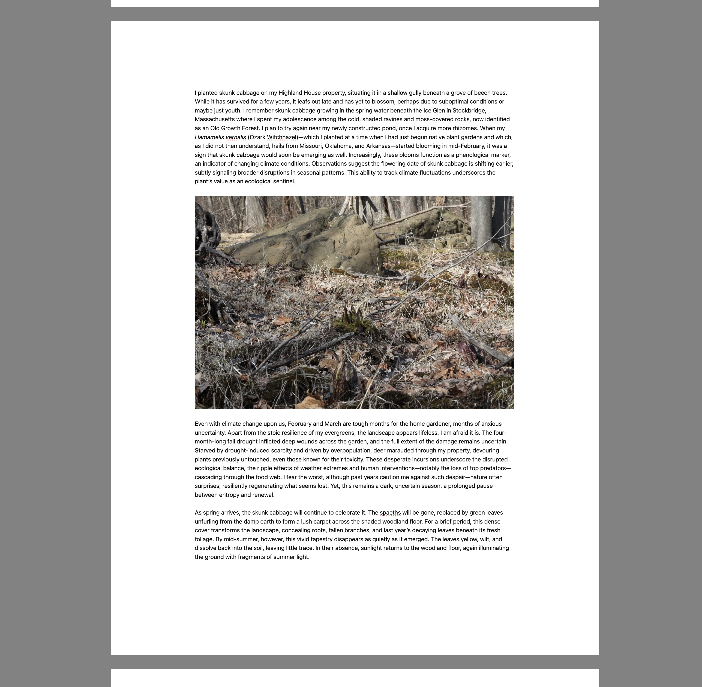

# Composition Mode

A distraction-free writing mode for Obsidian that turns the editor into a paginated, paper-like page. Designed for long-form writing where you want to see your text the way it will eventually print, without chrome, sidebars, or line-length surprises.

> **⚠️ New and experimental.** This is a young plugin. It has only been tested with the **Minimal** theme on desktop. Other themes may produce visual quirks around image embeds, page-gap bars, or text column sizing. Bug reports welcome — please include your theme name and a screenshot.

## What it does

- **Paper-like pages**: Your note renders as a stack of pages separated by visible gaps (Google Docs style), targeting a configurable word count per page.
- **Paginated view at any zoom**: Uses CSS `zoom` to magnify without reflowing, so page breaks stay stable while you scale up or down.
- **Soft backdrop**: A neutral gray behind the page, adjustable from light to near-black, to take the room out of your peripheral vision.
- **No status bar, no tab headers** while active. If sidebars are open, they will show. I recommend closing them first.
- **Per-note zoom memory**: Each note remembers its zoom level.

## Settings

| Setting | Default | Notes |
|---|---|---|
| Paper size | Letter | Letter or A4; controls page-break math (11/8.5 vs 11.69/8.27 aspect). |
| Show page breaks | On | Visible gray bar between pages at paragraph boundaries. |
| Words per page | 400 | Target; breaks snap to the nearest paragraph boundary above the threshold. |
| Page gap height | 60 px | Height of the gap between pages. |
| Default paper width | 90% | Percentage of viewport width the page occupies. |
| **Max paper width** | **1400 px** | **New in 1.1.0.** Absolute cap on page width. Prevents the page from ballooning on large external monitors. |
| **Image width** | **100%** | **New in 1.1.0.** Width of embedded images as a percentage of the text column. Centers automatically below 100%. Per-image overrides via `![[img.jpg\|400]]` still work. |
| **Side margin** | **1.25 in** | **New in 1.1.0.** Left/right margin between paper edge and text column. |
| **Top/bottom margin** | **1.0 in** | **New in 1.1.0.** Vertical margin on each page. |
| Default background | 35% | 0 = light, 100 = near-black. |
| Enable debug mode | Off | Writes verbose pagination logs to `working/composition-mode-page-break-debug.md`. |

## Install

### Via BRAT (recommended while this is unlisted)

1. Install [BRAT](https://github.com/TfTHacker/obsidian42-brat) from the community plugin directory.
2. In BRAT: **Add Beta Plugin** → paste `kvarnelis/composition-mode` → Add.
3. Enable **Composition Mode** under Community Plugins.

### Manual

1. Download `main.js`, `manifest.json`, and `styles.css` from the [latest release](https://github.com/kvarnelis/composition-mode/releases).
2. Drop them into `<your vault>/.obsidian/plugins/composition-mode/`.
3. Reload Obsidian, enable the plugin under Community Plugins.

## Use

- Open a note and toggle **Composition Mode** from the command palette (or bind a hotkey).
- A control bar appears on mouseover at the bottom edge: zoom, paper width, background slider, word count.
- Exit with the same command.

## Known limitations

- **Desktop only.** The isolation layer relies on DOM nodes that mobile Obsidian lays out differently.
- **Theme-dependent rendering.** Tested with Minimal. Other themes may:
  - Show visible slivers between the page-gap bar and the paper edge (caused by ancestor elements with non-standard padding or overflow rules).
  - Clip or misalign the page-gap bar's horizontal bleed.
  - Render image embeds at unexpected widths.
  - Override the paper background with a theme-specific color.
- **No live preview toggle.** The plugin operates on source/live-preview modes; switching to reading view while composition mode is active is untested.

## Changelog

See [CHANGELOG.md](CHANGELOG.md).

## License

MIT — see [LICENSE](LICENSE).
